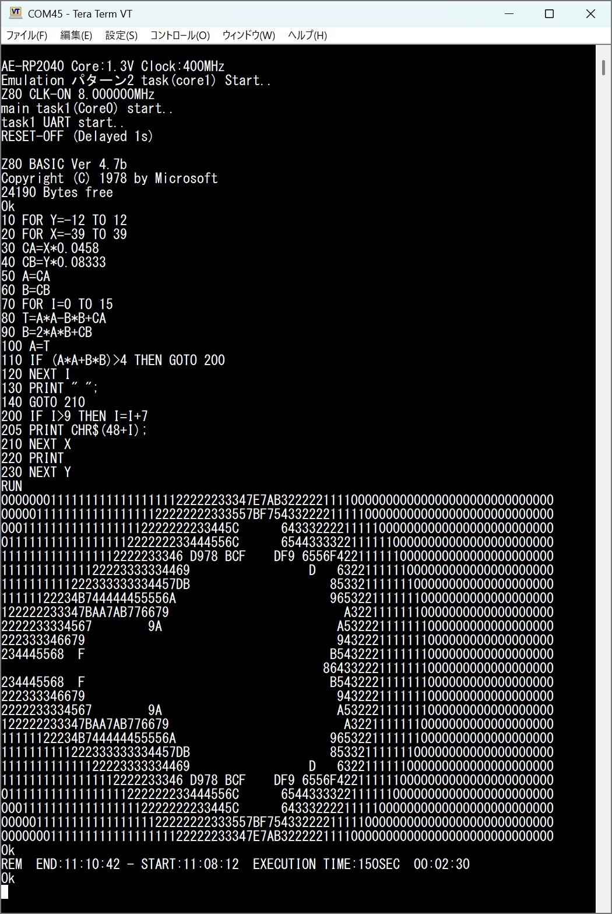
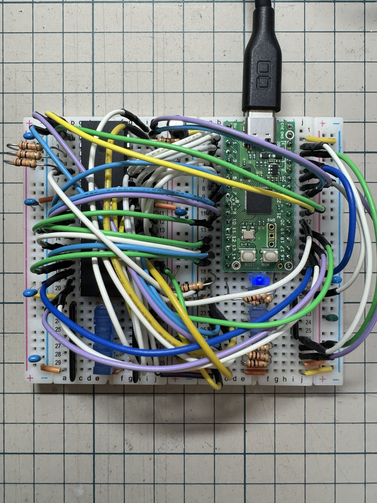
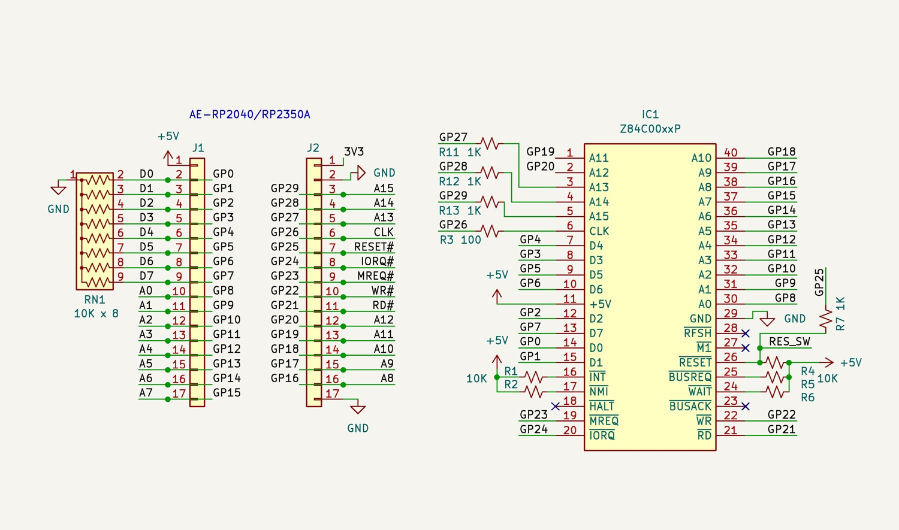

# AE-RP2040_EMUZ80 (English)

A peripheral and bus emulator for a physical Z80 CPU, designed to run on the Akizuki Denshi AE-RP2040 board.

This project uses the RP2040's PIO (Programmable I/O) subsystem to emulate the memory and I/O devices required to operate a real Z80 microprocessor, allowing the Z80 to run using only the AE-RP2040 board without additional peripheral ICs.

## Build Requirements
- Antigravity IDE (Recommended Build Environment)
- Pico C/C++ SDK
- CMake

## How to Build

This project has currently only been built and tested using the **Antigravity IDE**.

1. Open the project in the Antigravity IDE.
2. Ensure you have configured the environment for the RP2040 (pico).
3. Run the `/build` slash command to compile the project.
4. Run the `/flash` slash command to write the compiled `.uf2` file to your AE-RP2040.

*(Note: Standard CMake/Ninja build flows should theoretically work, but are not officially supported or tested.)*

## Acknowledgments

This project utilizes the **ROM-BASIC (EMUBASIC)** from the [EMUZ80 Project](https://vintagechips.wordpress.com/2022/03/05/emuz80_reference/).

The included EMUBASIC is based on **Grant Searle's NASCOM BASIC**. We are deeply grateful to Grant Searle (http://searle.x10host.com/) for making this classic software accessible, and to vintagechips for their work on the EMUZ80 project and making EMUBASIC available.

## License

This project is released under the **MIT License**. See the `LICENSE` file for details.

**Important Exception (ROM-BASIC):**
The included ROM-BASIC (`EMUBASIC`) is based on the work of Grant Searle and the EMUZ80 project. 
- Grant Searle's adaptations are for **NON-COMMERCIAL USE ONLY**.
- The EMUZ80 materials are generally provided under **CC BY-NC-SA 3.0** or similar Non-Commercial terms.
Therefore, the ROM-BASIC code embedded within this project (`AE-RP2040_EMUZ80.c`) is strictly bound by these Non-Commercial restrictions and is **NOT** covered by the MIT License.

---

# AE-RP2040_EMUZ80 (日本語)

実物の Z80 CPU を秋月電子 AE-RP2040 ボードのみで動かすための周辺回路・バスエミュレータです。

ソフトウェアでCPU自体をエミュレーションするのではなく、RP2040 の PIO (プログラマブル I/O) サブシステムを利用してメモリや I/O デバイスをエミュレートし、本物の Z80 マイクロプロセッサを動作させます。

## ビルド要件
- Antigravity IDE (推奨ビルド環境)
- Raspberry Pi Pico C/C++ SDK
- CMake

## ビルド方法

現在、本プロジェクトのビルドおよび動作確認は **Antigravity IDE** 上でのみ行われています。

1. Antigravity IDE で本プロジェクトを開きます。
2. RP2040 (pico) 向けに環境が設定されていることを確認してください。
3. `/build` スラッシュコマンドを実行してコンパイルします。
4. `/flash` スラッシュコマンドを実行して、生成された `.uf2` ファイルを AE-RP2040 に書き込みます。

*(注: 通常の CMake/Ninja を用いたビルドも理論上は可能ですが、公式にはサポート（テスト）していません)*

## 謝辞 (Acknowledgments)

本プロジェクトでは、[EMUZ80 プロジェクト](https://vintagechips.wordpress.com/2022/03/05/emuz80_reference/) の **ROM-BASIC (EMUBASIC)** を利用させていただいています。

含まれている EMUBASIC は、**Grant Searle 氏の NASCOM BASIC** をベースにしています。この歴史的な素晴らしいソフトウェアを利用可能にしてくださった Grant Searle 氏 (http://searle.x10host.com/) と、EMUZ80 プロジェクトを通じて EMUBASIC を提供・公開してくださった vintagechips 氏に深く感謝いたします。

## ライセンス (License)

このプロジェクト自体は **MIT ライセンス**の下で公開されています。詳細は `LICENSE` ファイルを確認してください。

**重要な例外 (ROM-BASIC について):**
ソースコード (`AE-RP2040_EMUZ80.c`) に含まれる ROM-BASIC (`EMUBASIC`) は、Grant Searle 氏および EMUZ80 プロジェクトの著作物に基づいています。
- Grant Searle 氏のコードは **「非商用利用 (NON-COMMERCIAL USE ONLY)」** に限定されています。
- EMUZ80 の関連資料は通常 **CC BY-NC-SA 3.0** 等の非商用ライセンスで提供されています。
従って、組み込まれている ROM-BASIC 部分のコードには上記の非商用制限が適用され、この部分については **MIT ライセンスの適用外** となりますのでご注意ください。
